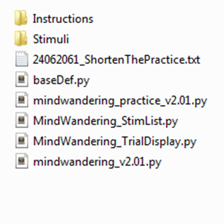

#Task folder structure
All the tasks I built after May, 2016?

I have develpoed an organisation of task scripts, so we can easily replace/edit instructions without edditing the scripts.
By dividing different part of experiemnts into modules/functions, it would be easier for debugging.
You don't always need to run the whole experiment while debugging. Testing single units save you time.
I can build a task very quickly now with this structure.
I shall edit a template for that when I have time.

### [task name]\_[verion]\_[last update date]
This is the name of the folder.
####Instruction: 
Containing instruction in .txt format. 
You just type in the instruction as how you want to present on the screen. '#' is a page breaker.
####Stimuli: 
Stimulus files. Includes condition lists or pictures, audio files... 
####baseDef.py
The basic functions for the experiments. This file should all be the same in every task.
I am adding more functions ie. fMRI trigger, linking to the YNiC inhouse module.
####[task name]\_TrialDisplay.py
This file inclused the actual functions that shows the trials.
I create fuctions for different screens/ different type of trials.
####[task name]\_[version].py
This is just the frame of the experiment. You assemble the functions built in [task name]\_TrialDisplay.py here.
This is also the file you run for the experiment. In otherwords, this is where the action happens.
####[task name]\_StimList.py (Optional)
For tasks with complicated condition order, I create a separate file to generate it, as it is easier to debug as a single moulude.
####[task name]\_practice\_[version].py (Optional)
This is just the frame of the practice. You assemble the functions built in [task name]\_TrialDisplay.py here.

####updatelog.txt (Optional)
Just an update log.
